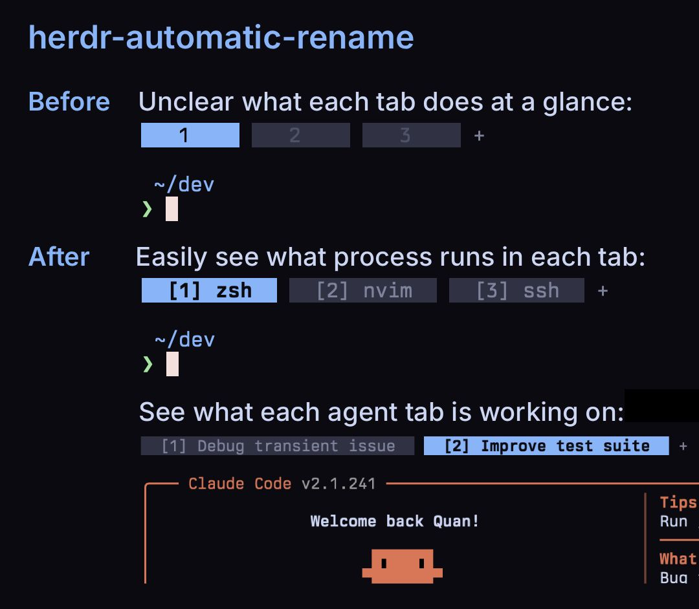

# herdr-automatic-rename

[](https://github.com/qu8n/herdr-automatic-rename/actions/workflows/ci.yml)



By default, herdr labels your tabs `1`, `2`, `3`, etc. This plugin automatically relabels them so you can immediately know what each tab contains. It also adds a `[N]` number prefix for keyboard-first users to quickly navigate across tabs.

Tab name examples labeled by this plugin:

```text
[1] zsh                                 a plain shell
[2] api › feat/oauth › nvim             directory › branch › program
[3] prod-01 › ssh                       a machine you reached over ssh
[4] PROJ-482 › Fix the revenue query    branch › what an agent is doing
```

## Install

Needs herdr `>= 0.7.1`, `jq`, and bash, on Linux or macOS.

```sh
curl -fsSL https://raw.githubusercontent.com/qu8n/herdr-automatic-rename/main/install.sh | bash
```

That installs the plugin and adds the shell hook, which is what makes a rename land the moment a command starts. It picks the hook for your login shell out of zsh, bash, and fish, and writes it to that shell's startup file. Running it again changes nothing, so it is also the upgrade path. Add `bash install.sh fish` style arguments to wire a second shell, or set `HAR_RC` to write a startup file other than the default (macOS login shells read `~/.bash_profile`, not `~/.bashrc`).

Two steps are left for you, because a script should not make either choice behind your back:

**1. Turn off herdr's new-tab name prompt.**

A name typed there counts as a hand rename, which opts every new tab out of being renamed by this plugin until you `reset` it. Thus it's better to turn this off:

```toml
# ~/.config/herdr/config.toml
[ui]
prompt_new_tab_name = false
```

**2. Install the herdr integration for the coding agents you use.**

See [herdr's integrations docs](https://herdr.dev/docs/integrations/) for installation details. This lets herdr then detect an agent natively instead of by reading the screen, which makes for steadier agent tab names.

<details>
<summary>Rather wire it up by hand</summary>

Install the plugin:

```sh
herdr plugin install qu8n/herdr-automatic-rename --yes
```

Then add the hook for your shell. Each snippet globs herdr's managed plugin directory, whose name carries a version hash that changes under every upgrade.

zsh (`~/.zshrc`):

```zsh
for _f in ${HOME}/.config/herdr/plugins/github/herdr-automatic-rename-*/shell/hook.zsh(N); do
  source $_f; break
done
```

bash (`~/.bashrc`, after any prompt or history tool like starship or atuin):

```bash
for _f in "$HOME"/.config/herdr/plugins/github/herdr-automatic-rename-*/shell/hook.bash; do
  [ -r "$_f" ] && { source "$_f"; break; }
done
```

fish (`~/.config/fish/config.fish`):

```fish
for _f in $HOME/.config/herdr/plugins/github/herdr-automatic-rename-*/shell/hook.fish
    test -r "$_f"; and source "$_f"; and break
end
```

</details>

## Configuration

Every setting has a working default, so this part is optional. To change a config, write it to `~/.config/herdr-automatic-rename/config.sh` (or point `HERDR_AUTOMATIC_RENAME_CONFIG` elsewhere).

| Setting | Default | What it does |
| --- | --- | --- |
| `NAME_TABS` | `1` | Name tabs at all. `0` leaves names alone and only numbers them. |
| `AUTO_INDEX` | `1` | Prefix rows with their `1-9` jump key. `AUTO_INDEX_WORKSPACES`, `_TABS`, and `_AGENTS` carve out exceptions. |
| `TAB_CONTEXT` | `1` | Show the `<where>` half: directory, branch, or ssh host. |
| `SHOW_BRANCH` | `1` | Add the checked-out branch. Trunk branches and branches that repeat what is on screen are left out. |
| `AGENT_TITLES` | `1` | Name an agent tab after the task it reports, not after `claude`. |
| `TITLE_STYLE` | `task` | `name_and_task` keeps the agent in front: `cc:auth-flow`. Worth it when you run several agents. |
| `TITLE_CONDENSE` | `0` | Keep a long title's keywords instead of cutting off its tail. |
| `HIDE_SHELL` | `0` | `1` shows nothing for a plain prompt, so herdr's own number shows through. |
| `ICONS_ENABLED` | `0` | Nerd Font glyph in front of the name. |
| `PROGRAM_ALIASES` | none | Rename programs on the tab: `"lazygit=lg"`. |
| `MAX_NAME_LEN` `MAX_TITLE_LEN` `MAX_CONTEXT_LEN` `MAX_BRANCH_LEN` | `20` `28` `12` `12` | Character budget per part of the label. |

See [config.example.sh](config.example.sh) for the full configuration details.

## Actions

`reset` re-adopts a tab you renamed by hand. `clear` strips every `[N]` number prefix, restores base names, and reverts agents to detection. `doctor` prints why the current tab has the name it has. Run one from the CLI, or bind it in `config.toml` as a `plugin_action`:

```sh
herdr plugin action invoke herdr-automatic-rename.reset
```

## Uninstall

Strip the labels first, else `clear`'s renames re-fire the hooks. The strip reaches one herdr session, the one its shell belongs to, so run it once per session:

```sh
bash "$(herdr plugin list --json \
  | jq -r '.result.plugins[]|select(.plugin_id=="herdr-automatic-rename").source.managed_path')/automatic-rename.sh" --clear
herdr plugin uninstall herdr-automatic-rename
```

Then delete `~/.local/state/herdr-automatic-rename/`.

## Caveats

- **Your renames win.** Rename a tab yourself and naming leaves it alone, though numbering still applies. `reset` hands it back.
- **Numbering stops at 9.** No binding reaches a 10th row, so the rest keep plain names.
- **An agent answers to either of its names.** herdr knows `cursor-agent` and `kiro-cli` as `cursor` and `kiro`, so one `PROGRAM_ALIASES` entry covers both spellings. Muse is the same, including its `muse-bin-<version>` build.
- **Naming needs a foreground process.** Some Linux container and sandbox setups hide one from herdr, so naming stops while numbering keeps working. On herdr `>= 0.8.0`, set `HERDR_PROCESS_DETECTION=child-groups` in its environment.
- **On herdr below `0.7.4`** a new name lands but only shows at the next redraw, such as a focus change.

## Troubleshooting

Each entry is a symptom and the command that explains it. `doctor` runs one real naming pass and prints what that pass saw and decided about the current tab, so what it says is what the plugin did.

**One tab is not being named.** Run `doctor` on it. A record reading `enabled=false` means you renamed the tab by hand at some point, and the plugin keeps its promise to leave it alone. Run `reset` to take it back.

**Nothing is named at all.** Run `doctor`. The first lines say which herdr and jq it found and where the state directory is. A missing one of those is the whole story: the plugin exits without a word when a prerequisite is gone.

**Names are stale, or lag one event behind.** Set `AR_TRACE=1` in the environment herdr launches with, reproduce, and read `~/.local/state/herdr-automatic-rename/trace.log` (a named session keeps its own copy under `sessions/<name>/`). Turn it off afterwards. The log can contain task titles, which is why it lives in the state directory at `0600`.

**Numbers are off by one.** Collapse has no event, so the numbers settle at the next one. Focus another tab and come back.

```sh
herdr plugin action invoke herdr-automatic-rename.doctor
```

## Contributing

See [CONTRIBUTING.md](CONTRIBUTING.md) and [docs/ARCHITECTURE.md](docs/ARCHITECTURE.md).

## License

MIT.
